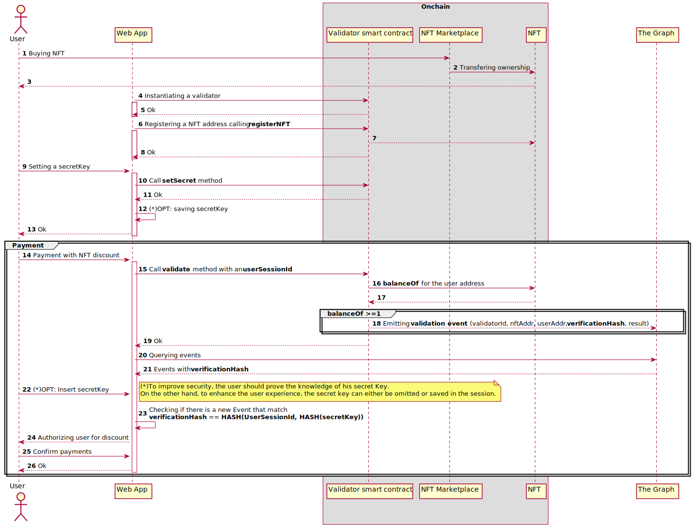
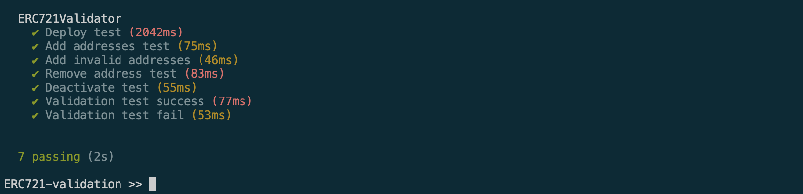
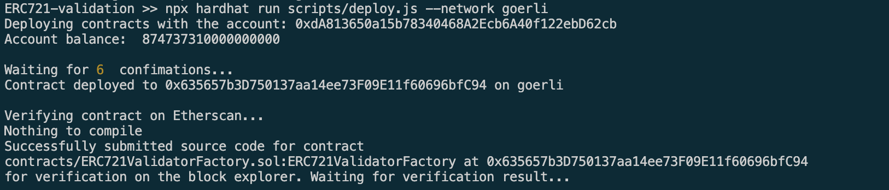
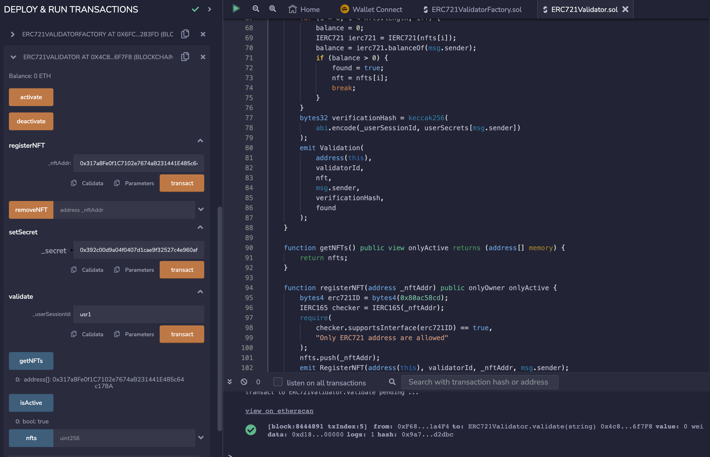
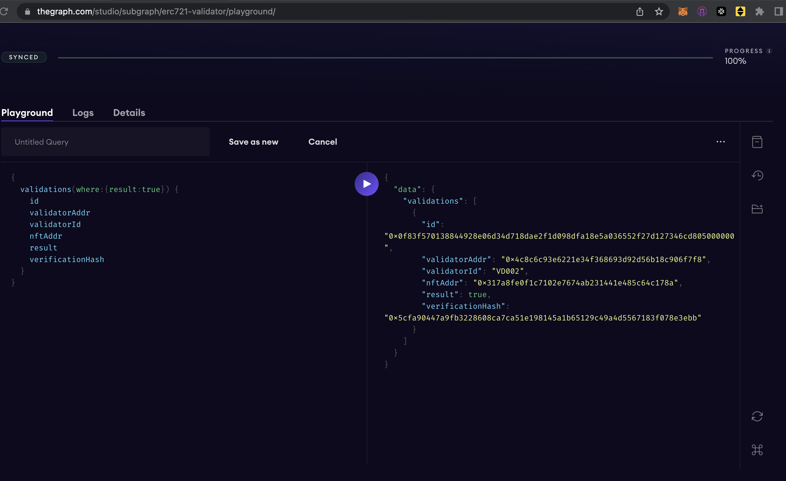

# Real NFT application in the "real world 2.0"

# Introduction
An NFT can be deemed valuable when its unique characteristics allow the exercise of rights over goods, services, products, or access. In this article, we will examine this use case, which is straightforward to implement in a fully decentralized application where the NFT is linked to our account and we operate only inside the chain. However, the scenario changes when we want to verify NFT ownership in a Web 2.0 application where we aim to receive, for example, a discount through a FIAT payment.

We analyze this second scenario because well-established brands may find it too burdensome to completely revamp all their processes to align with a strict 3.0 standard, and it may be more prudent to gradually integrate the new methodologies and protocols.
We will explore how to accomplish this by integrating TheGraph, GraphQL, Ethers, a Web 2.0 application, and utilizing the event system of the Ethereum Virtual Machine.

# The idea


The sequence diagram illustrates one of the potential use cases we aim to depict. A store opts to register an NFT to grant a discount privilege to the owners of this collection. Let's delve into the steps of the sequence diagram.

[1-3] The user acquires the NFT from a marketplace such as OpenSea.

[4-8] The platform launches a validation smart contract and records the NFT's address for which the owner intends to apply a special offer.

[9-13] The user sets a secret key through the web application.

[14] The user accesses the page to perform the transaction for the product.

[15] Upon logging in, the user will be prompted to invoke a method on the validation smart contract to verify NFT ownership. A session ID, with a limited validity of the user's choice, is attached to the smart contract call.

[16-18] The method generates an event that reports whether the user owns the NFT eligible for promotion. An attached verification hash, calculated as follows, is attached to the event: HASH(userSessionId, HASH(secretKey)).

[20-21] The application queries the events through The Graph protocol.

[22-26] The payment with discount and NFT ownership are confirmed only if the hash calculated by the smart contract matches the expected hash in the web application. In this case, the user may be required to re-enter their secret key.

# Execute the code
The developed code includes the logic for a smart contract and the files necessary for generating a subgraph to be published on The Graph.
These are the key files of the project.

| Filename                            | Usage                                                                                                  |
| ----------------------------------- | ------------------------------------------------------------------------------------------------------ |
| contract/ERC721ValidatorFactory.sol | The factory contract to instatiate a new validator                                                     |
| contract/ERC721ValidatorFactory.sol | The Validator contract that caontains all the logics                                                   |
| test/ERC721Validator.js             | Unit tests files                                                                                       |
| abis/                               | The folder must contain the abis of the contracts                                                      |
| schema.graphql                      | The GraphQL schema that defines what data is stored for your subgraph, and how to query it via GraphQL |
| subgraph.yaml                       | The subgraph manifest where you have to insert the ERC721ValidatorFactory address                      |
| network.json                        | Network configuration file where you have to insert the ERC721ValidatorFactory address                 |
| src/mapping.ts                      | Graph code that translates from the event data to the entities defined in your schema                  |
| .env                                | Environment variable file                                                                              |
| harhat.config.js                    | Hardhat configuration file                                                                             |


## Requirements
* Install [Node](https://nodejs.org/en/)
* Clone the repository ```git clone https://github.com/kchain-solutions/ERC721-validation.git```

For the successful execution of the code, it is required to compile the ```.env``` file with the appropriate configuration parameters.

```
MNEMONIC=""
GOERLI_ENDPOINT=https://goerli.infura.io/v3/xxxxxxxxxxxxxxxxx
ETHERSCAN_API_KEY=yyyyyyyyyyyyyyy
```

## 1. Install packages and run unit-tests
```shell
npm install
npx hardhat test
```


## 2. Deploy ERC721ValidatorFactory

```shell
npx hardhat scripts/deploy.js --network goerli
```



## 3. Insert the ERC721ValidatorFactory address into the subgraph.yaml and network.json

```yaml
specVersion: 0.0.5
description: ERC721Validator
repository: https://github.com/kchain-solutions/ERC721-validation
schema:
  file: ./schema.graphql
dataSources:
  - kind: ethereum
    name: ERC721ValidatorFactory
    network: goerli
    source:
      address: "ADDRESS HERE"
      abi: ERC721ValidatorFactory
      startBlock: 8443300
    mapping:
      kind: ethereum/events
      apiVersion: 0.0.7
      language: wasm/assemblyscript
      entities:
        - NewERC721Validator
      abis:
        - name: ERC721ValidatorFactory
          file: ./abis/ERC721ValidatorFactory.json
      eventHandlers:
        - event: NewERC721Validator(address,string,address)
          handler: handleNewERC721Validator
      file: ./src/mapping.ts
templates:
- kind: ethereum
  name: ERC721Validator
  network: goerli
  source:
    abi: ERC721Validator
  mapping:
    kind: ethereum/events
    apiVersion: 0.0.7
    language: wasm/assemblyscript
    entities:
      - Validation
    abis:
      - name: ERC721Validator
        file: ./abis/ERC721Validator.json
    eventHandlers:
      - event: Validation(address,string,address,address,bytes32,bool)
        handler: handleValidation
    file: ./src/mapping.ts
```

```json
{
    "ethereum": {
        "goerli": {
            "address": "ADDRESS HERE"
        }
    }
}
```
## 4. Play with remix
You can play the contract cloning the repository using Remix.

Remeber the process: 
* Only the contract creator address can call the ```registerNFT``` method.
* You should associate the NFT just registered to the user
* The user address MUST set an hashed secret with ```setSecret```. Take a look to Utility functions and ```npx hardhat hashSecret --secret "kchain"```
* The user can finally call ```validate```

## 5. Deploy the subgraph to read events following [this tutorial](https://github.com/kchain-solutions/thegraph-simple-blog) 
```shell
npm install -g @graphprotocol/graph-cli
graph auth --studio <DEPLOY KEY>
npm run codegen
npm run deploy
```
Here is a query example to retrieve successful validations
 

# Utility functions

## Export abi files from ./artifacts to ./abis
```shell
npx hardhat run scripts/loadAbiFiles.js
```

## Hashing a secretKey with Keccak256
```shell
npx hardhat hashSecret --secret "kchain"
``` 

## Hashing a secretKey with Keccak256
```shell
npx hardhat hashSecret --secret "kchain"
``` 

## Calculate hash equality
```shell
npx hardhat controlHash --secret kchain --user-session-key session1  --hash 0x0b29ecc5ee57a77bb9b0b16b32d5e3d7bfb209512685705ad98746c0c357bbda
```


**If you need further clarification on the use of the code, do not hesitate to contact me for advice**